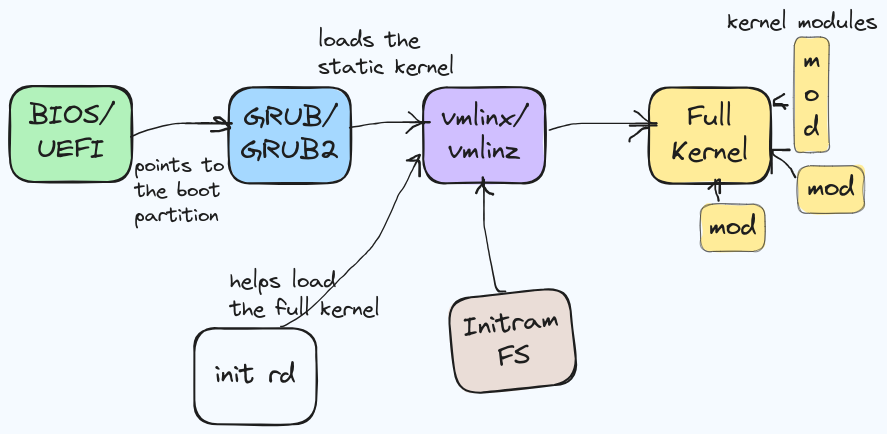
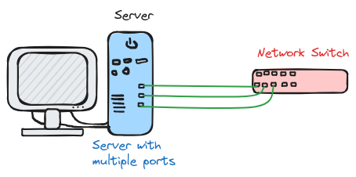
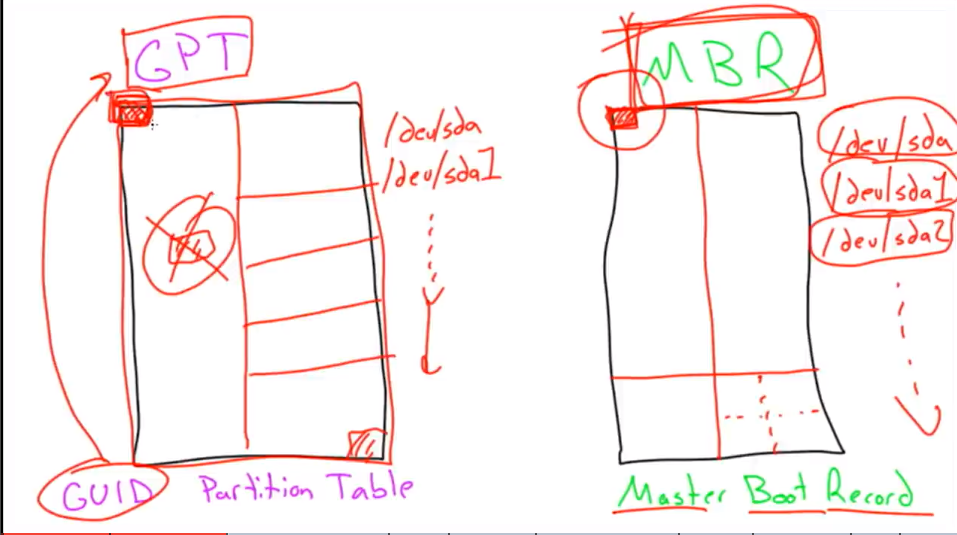
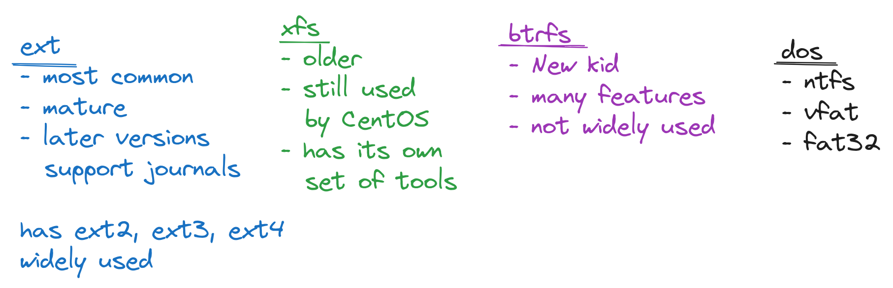
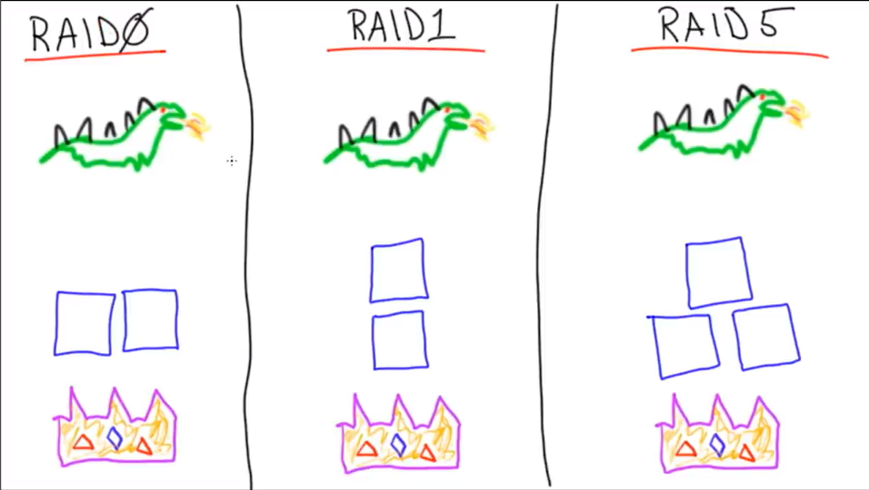
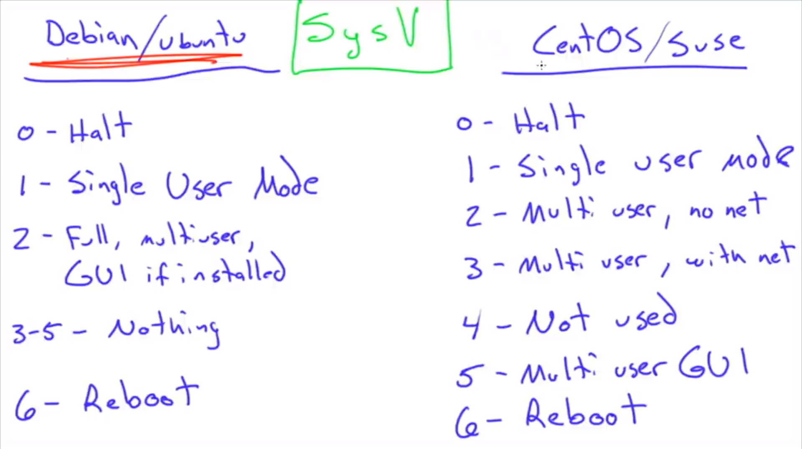

Title: Linux - System Configuration and Operation notes
Date: 2024-02-27 10:11
Author: Sahil Sagwekar
Category: Linux
Slug: linux-server-system-config-and-operations

Notes from the FCC course [Linux Server Course - System Configuration and Operation](https://youtu.be/WMy3OzvBWc0)
# BIOS vs UEFI
- **Basic Input Output System** v/s **Unified Extensible Firmware Interface**
- BIOS is much older and modern machines mostly ship with UEFI.
- BIOS and UEFI do basically the same thing i.e. communicating between the Hardware and the Operating System software.
	## BIOS
	- BIOS supported MBR (Master Boot Record) which was a small sector on the HDD which contained the code to boot the OS.
	- BIOS also had limited capacity to support large HDDs, although there are hacks around it.
    ## UEFI
	- UEFI on the other hand has an entire boot partition, which stores the entire boot code for the OS.
# GRUB vs GRUB2
| GRUB                                                    | GRUB2                                       |
| ------------------------------------------------------- | ------------------------------------------- |
| - Also known as GRUB _legacy_.                          | - GRUB2 is used by most new distros         |
| - `ls /boot/grub/` will contain **menu.lst, grub.conf** | - `ls /boot/grub` will contain **grub.cfg** |
| - difficult to modify                                   | - customizable in _/etc/default/grub_       |
| - boot menu usually displays on boot                    | - can boot ISO, USB, UUID, device           |
|                                                         | - hidden boot menu (press shift!)           |
# Boot Methods
- ## Hardware vs Software
- ## PXE, USB, CD, iPXE, ISO
- **Pre-boot execution environment i.e. PXE** - Boots up over the network (iPXE is and advanced version) needs the boot image stored on a TFTP server.

*These methods are not Linux-specific, but Hardware supported.*
- **iPXE** Supports boot image download over HTTP which is faster.
- **USB**, **HDD**, **CD** - Hardware medium, the computer knows how to read from this media.

# Boot Process
- `init rd` or the *init ramdisk* is like the temporary staging ground which helps the static kernel i.e. `vmlinuz` get to the full kernel.
- The `vmlinux` is the static, stripped-down core of the kernel. All the kernel modules are stored on the disk and together comprise the Full Kernel.
- `vmlinuz` is just the compressed version of this kernel.
- `InitramFS` is a small filesystem used by the static kernel.


- The init ramdisk images and compilation configuration files are stored inside the `/boot` directory.
- the kernel modules are stored inside the `/lib/modules` directory
- The above 2 points apply for Ubuntu.

# Kernel Panic!
## Something just went wrong with your kernel.
1. Maybe try updating your kernel, but it it's already up-to-date it could be your hardware who's at fault.
2. (Overclocked CPU, bad RAM)
3. If a system update gives your *Kernel Panic* **Then just load the GRUB menu and select an older version of the kernel which you will have inside the `/boot/grub/`**
4. Then remove the latest kernel, and try to re-install it. Or wait for updates.
5. Or we can boot from a USB or a CD and transfer the data from the storage.

# Loading Kernel Modules on Boot
We can configure what modules are loaded or not.
- **loading**
- **blacklisting**
*To stop unwanted modules from loading -->*
1. Edit `/etc/modules`.
2. Add/delete the name of the module. Dependencies will be automatically loaded.
3. **Blacklisting** - Go to `/etc/modprobe.d/blacklist.conf` and edit it's contents.
4. For e.g. - Useful when trying to load the correct sound card drivers.

# Manipulating Kernel Modules
| command      | description                                                                         |
| ------------ | ----------------------------------------------------------------------------------- |
| **insmod**   | insert module directly into running kernel (RAW)                                    |
| **rmmod**    | removes installed kernel module                                                     |
| **modprobe** | insert the module, collecting the correct deps etc.                                 |
| **lsmod**    | list installed kernel modules                                                       |
| **depmod**   | update the system map to make a newly installed kernel module available to modprobe |

| insmod                      | modprobe    |     |
| --------------------------- | ----------- | --- |
| -path only                  | - name only |     |
| - no deps                   | - deps      |     |
| - fail with not explanation | - needs map |     |
_modprobe_ uses *insmod* in behind-the-scenes.
## Loading a Kernel module (example) -
- Check the current kernel version using `uname -r`
- All the available kernel modules are inside `/lib/modules/<your-kernel-version>/kernel` directory.
- You can further narrow down by cding into the directories e.g. `/drivers/<category e.g. net>`
- If we try installing a module using `insmod` (specify the path to the `.ko` file) we get Unknown erros.
- If we try the same using `modprobe <kernel-module-name>` it works fine.
# 2. Networking
# Testing Network Connectivity
1. **Just check the cables** - Sometimes you will find yourself spending hours on the command line only to discover that your ethernet cable is loosely connected.
2. **Turn off and turn back on** - any device or interface.
## Tools -
- **ping**
- **ip add**
## Basic steps to troubleshoot -
1. Ping a domain name e.g. google.com
2. Ping an ip address e.g. 8.8.8.8
3. Check your own ip address on the local network using `ifconfig` or `ip add`
4. ping your own LAN ip address (the one in the *eth0* section)
5. ping other devices on your network
6. Check `ip route` , see if **default route** exists.

#### Layer-wise -
1. Layer 3 (network) `ping` and `traceroute` commands.
2. Layer 4 (transport) `netstat` and `telnet` commands.
3. Layet 7 (application) `curl` command.
# Testing DNS
## Tools -
- **ping, dig**
- **nslookup, host**
## Commands
These commands not only query the host but also allow you to *choose which DNS server to query*
- `dig @<dns-server> host`
- `nslookup host <dns-server>`
- `host host <dns-server>`

# Common Network Config Files
### Location of Config files might change across distributions but we are gonna talk about ones which are mostly common across distros. -->

- ## /etc/hosts
	maps ip address to domain names, locally for e.g.
	```
	127.0.0.1    localhost
    ```

- ## /etc/nsswitch.conf
	Configures a bunch of things like group and password files.
	See the `hosts` line
	```
	hosts:    files, mdns4_minimal [NOTFOUND=return] dns myhostname
    ```
    - Here the `files` word is first which means that the system will look through the `/etc/hosts` file first.
    - `mdns4_minimal` for local lookups.
	- The `dns` keyword is for the default DNS server.

- ## /etc/resolv.conf
	 Tells the computer which *nameserver* to use. \[Do not change anything here as this file is created on the fly by the `systemd-resolved` service\]

# Identifying network files in Debian and Ubuntu
Older version of Debian and Ubuntu (16.04 LTS) had different network configuration
	- Inside the `/etc/network` we find a *interfaces* file
**Both version still use the same GUI i.e. Network-Manager**

New version have `/etc/netplan`
	- And inside it we have a `cloud-init-yaml`
	- `sudo netplan apply` to apply the new configuration
- One more way is to use `nmtui` (network manager tui)

	*RedHat and CentOS apparently have a more elegant network configuration solution inside the `/etc/sysconfig` directory
	- for e.g `/etc/sysconfig/network-scripts` file *
	- Allows us to make changes in the same file

# Network Bonding Modes
- Network bonding in Linux is just a way to utilise multiple ethernet ports.
- Rather than having unique IPs for each port, we want to use the combined bandwidth.
- Following are the **network bonding modes**
- **Switch Support** refers to the capability of the network switch to support the said network mode.


| MODE | Description | Need Switch Support? |
| ---- | ---- | ---- |
| 0 | balance-rr (round robin) | sort of |
|  1 | active backup | No |
| 2 | balance-Xor | Yes |
| 3 | broadcast | Yes |
| 4 | 802.3ad | Yes |
| 5 | balance-tlb | No |
| 6 | balance-alb | No |
1. **MODE 0 - Balance Round Robin** - Sequentially packets go through each port, for e.g.
   *packet1 -> port1, packet2 -> port2, packet3 -> port3* etc. Need a switch to support link aggregation.
2. **MODE 1 -  Active Backup** - Only one port is active and it switches to the other port if current one fails. Doesn't require switch support as only 1 port is being used. Doesn't increase throughput.
3. **MODE 2 - Balance XOR** - In short, maps particular clients to specific ports, using MAC addresses. but if we have switch support we use **802.3ad**
4. **MODE 3 - Broadcast** - specific use cases. *broadcasts* all the data from all ports at once.
- *Standard for smart switches (supporting link agg.)*
1. **MODE 4 - 802.3ad** - Industry standard if the switch supports *link aggregation*
2. **MODE 5 - Balance (transmit load balance)** - Load balances the outward transmission, incoming is still through one port.
- *Standard for Dumb switches*
1. **MODE 6 - Balance (all load balance)** - Load balances incoming+outgoing. Least busy port get the traffic. Achieves this by constantly switching MAC addresses.

# Configuring Network Bonds
Dependent upon the underlying system's network management tool.
<--redacted-->

# Understanding **GPT v/s MBR**
**GPT is newer and more feature-rich than MBR**
- **MBR** stands for (Master Boot Record)
- This system stores the partition index/table in a small chunk at the start of the drive.
- It can create only four partitions.
- Limited to **2 Terabytes**

- **GPT** stands for (GUID Partition Table)
- GUID stands for (Global Unique Identification)
- It stores copies of the partition data in multiple chunks across the drive.
- GPT also allocates a chunk in the beginning (like MBR) which makes it compatible with older systems which use BIOS, but it doesn't identify the partitions.


# Filesystem Hierarchy
- We have a harddrive `/dev/sda1`. It has the root partition.
- Some are **Virtual Filesystems** for. e.g. `/proc/` & `/sys/` to modify the running kernel
- Remote NFS/Samba
- USB Drive through `/media/USB1/` , for example.
- Another (second) harddrive will be mounted as for e.g. `/mnt/data/`
# Creating Partitions
- **partd / gparted** - on newer system, intuitive to use
- **fdisk** - *Available on all systems, hence important to know*

**# info tools -**
- `lsblk` - Lists all the block devices in the system.
- `blkid` - to list all the block devices with the **filesystem type**
- `sudo fdisk -l` - same as above

# Formatting Filesystems
## Tools -
1. `mkfs` - literally, make file system. *Used to format partitions with a particular filesystem format.*

# Mounting Partitions
can do it manually using tools like -
- **mount / umount**
- **/etc/fstab -- to do it automatically on boot**
- **`blkid`**

## /etc/fstab config format explanation
The format looks like this -
```
# <file system> <mount point>   <type>  <options>       <dump>  <pass>
```
e.g. configuration -
```
/dev/sdb1    /mnt/10gig    ext4    defaults    0    2
```

1. \<file system\> - specify the path to the device. (We can either use the **UUID**, from blkid for the device name)
2. \<mount point\> - specify the path at which the device will be mounted.
3. \<type\> - type of filesystem
4. \<options\>
5. \<dump\> - an old backup utility.
6. <pass\> - stands for *perform automatic system scan*, scans the filesystem for health.
   **1** priority is for the `/` root partition.

# Scanning Filesystems
1. **tune2fs**
2. **/etc/fstab**
3. **fsck**
## How to setup the system to Scan the filesystem on boot, including the root fs.
## Steps -
- Use `tune2fs` to check the 'max boot count' param, set to a suitable value.
- the system will automatically scan the device after the specified boot count.
- If you have to do it manually on your *root fs, you can also boot from a cd, or a usb with a live distro and run `fsck` on your main root storage drive.*

# LVM (Logical Volume Manager)
- Takes **Physical volumes** --> combines them into **Volume groups** --> Carves out **Logical volumes** from the aggregated volumes.
- -> Like a software SAN (Storage Area Network)

# Building an LVM System
---

- `pvcreate` - to turn raw devices into physical volumes e.g.-
  ```bash
  $ pvcreate /dev/sdb /dev/sdc /dev/sdd /dev/sde
  ```
- `pvdisplay` - to display the physical volumes.

------------

- `vgcreate` - create a volume group (combined storage)
  ```bash
  $ vgcreate bucket /dev/sdb /dev/sdc /dev/sdd /dev/sde
  ```
- `vgdisplay` - to list volumes groups.
---

-  `lvcreate` - to carve out logical partitions from the volume group
   ```bash
   $ lvcreate -L 32G -n BIG_SLICE bucket
   ```
- `lvdisplay` - to display the logical volumes.
- `lvextend` - to extend the storage in an existing logical volume.

### LVMs are not redundant, if one physical devices crashes, data is lost. For this we implement RAID

# RAID - Redundant Array of Independent Disks or Drives
> **Allows us to implement performance and redundancy.**
## RAID levels

1. **RAID 0** - Stripe array setup
2. **RAID 1** - Mirror drives
3. **RAID 5** - Parity Drive

 # Configuring **RAID** with `mdadm`
 - While setting up devices for RAID, it is good practice to use partitions which are slightly smaller than the raw device size, because if we want to replace that drive, we need to have enough storage on the new device.
 - **For e.g. 2 HDDs from 2 different manufacturers both say 100GB but in reality they could have slightly different number of sectors.**
## *Steps -
1. Partition your physical drives, e.g. 9.9G partition for 10G drives. Using `fdisk`
2. While using `fdisk` , mark the drive as *Linux raid drive/partition*
3. Now let's use `mdadm` to actually create the RAID drive

```bash
$ mdadm --create --verbose /dev/md0 --level=5 --raid-devices=4 /dev/sdb1 /dev/sdc1 /dev/sdd1 /dev/sde1
```

4. Check the output in `cat /proc/mdstat`
5. To save the configuration -
   1. perform a detailed scan to get the config.
```bash
$ mdadm --detail --scan
```
   2. Now redirect this into the following file
```bash
$ mdadm --detail --scan > /etc/mdadm/mdadm.conf
```

6. Now we just treat it like any other block device -
```bash
$ mkfs.ext4 /dev/md0
```

# Installing Tarballs
*Extract, Compile, Install*

- `make` - Just use make to run compilation commands from the *Makefile*
- No way to update the program!
- Security concerns

# Managing .deb Files
- apt, apt-get, aptitude
- *dpkg* doesn't resolve dependencies, *apt* does.

| apt | aptitude | apt-get |
| ---- | ---- | ---- |
| newer | older | oldest |
| simpler | still works | still works! |
| use this! | don't use | don't use |
# Handling RPM packages
1. **YUM**
   - Yellowdog Updater Modified
   - Handles dependencies
   - Updates repo when installing/upgrading
2. **DNF**
   - DaNdified YUM (no, really)
   - In Fedora, will replace YUM
3. **RPM**
   - low level tool
   - doesn't resolve dependencies.

# Configuring APT repositories
- sources.list / sources.list.d
- GPG keys
- PPA - **Personal package archive**
```bash
$ cd /etc/apt
$ ls
apt.conf.d preferences.d sources.list sources.list.d trusted.gpg.d
```

*We can add a repository entry in the end of the sources.list.d file or **create a new file.**
e.g.
```
deb https://deb.opera.com/opera-stable/ stable non-free
```
- The above line is the entry for the opera browser apt repository.

- *After updating we need to perform `apt update`*
- We also get a warning that the *Opera repo is not signed*
- To solve this, we need to download their GPG key and then add it using
  `apt-key add -`

\# Adding a Repository using a **PPA**
```bash
$ add-apt-repository ppa:webupd8team/atom
```
# User Management
- **useradd, userdel, passwd, usermod**
- Add a user to the sudo group, same as adding the user to the /etc/sudoers file -
```bash
$ sudo usermod -aG sudo username
```
# Local groups
- primary groups - The default group, has the same name as the user
- secondary/supplementary groups.
- **groupadd, groupmod, groupdel**
- `groups <user_name>` - to list the groups a user is in. *The first group listed is the **primary group**
- `usermod -a -G` - **-a** is for append, and **-G** is to specify supplimentary group, **-g** is to change primary group

## Primary vs Secondary groups
*If a user creates a file, by default the primary group also becomes the owning group of that file.*

# Querying User Accounts
- **w, who, pinky, last, id, whoami**
- `whoami` - Who are you
- `who` - who's logged into your system
- `pinky` - some more info with who
- `id` - gives related ids
- `last` - login/logout records of multiple users *(Important for remote servers)*

# Managing Group Password Files
- Linux implements **shadow files** to store encrypted passwords. These files can only be accessed by the *root user, which is the system.*
- **/etc/passwd, /etc/shadow, /etc/gshadow**
- **To edit passwd files we use a special command -** `sudo vipw`
- **To reflect these changes in the shadow file, we use -** `sudo vipw -s`
- `sudo vigr` & `sudo vigr -s` to edit group passwd and shadow files respectively.

# Quotas - user and group quotas
 - soft and hard limits
   - Soft limits will give a warning, Hard limits prevent the user from using the storage
 - `quotacheck/quotaon`

*Mount a partition correctly to enable quotas*
- add the `usrquota` option along with *defaults*
- Quotas are not turned on by default
- `sudo quotacheck -au` - Scan the existing files for a file owned by a particular user
- `sudo quotaon -a` - To turn quotas on for all supported partitions
- `sudo edquota bob` - To enable quotas for a particular user.
- **There are two types of quotas -**
  1. *blocks* - block storage
  2. *inodes* - number of files (an inode is a file)

# Identifying User Profiles
- `/etc/profile` - Is the settings for the login shell, not for user shells. It is used only once.
- `/home/user/.profile` - or `.bash_profile` - applied after the sytem-wide settings.

# STDIN, STDOUT, STDERR

## Input/Output Tips & Tricks
1. **/dev/null** -
   - It's kind of a black hole
   - If we copy / redirect anything to this location, it will disappear
2. **tee** -
   - Outputs to STDOUT and also writes to a file
3. **xargs** -
   - *app1  --STDOUT--> STDIN--> xargs --> app2+arguments*
   - takes the output from the first command and puts it as an argument in the second command.
## Examples -
- `ls Documents ff > /dev/null 2>&1`
  **2>&1 - means that the error will be redirected to STDOUT**
# Text Manipulation with Command line tools
- *cut / paste*
- *sort*
- *wc* - wordcount
```bash
$ wc file1.txt
4  4 file1.txt
$ wc -m file1.txt
27 file1.txt
```
	*4 - words*
	*4 -lines*
	*27 - characters*
- *cut* -
```bash
$ cut -c 1 file1.txt
l
w
f
f
```
- *paste* - appends text line-by-line

# Text Manipulation with `awk` & `sed`
- **sed** - Stream editor - Non-interactive editor
- **awk** - Aho, Weinberger, Kernighan - Data extraction tool

# Hard links and Soft links
- Soft link is a symbolic link. It only points to the file name. If we rename the original file, the link will break.
- Hard links have different file names but point to the same part of the HardDrive
- `ls -li` - hard links will have the same *inode*
**Hard links point to inodes, Soft links point to file names**
# `find` vs `locate`
Locate maintains a database of all the files in it's cache, which is refreshed on a daily basis. To update this cache manually we use `updatedb` command.
# Copying Files Over the Network
- ssh, scp
- rsync

`scp <remote_user>@<remote_host:<file_path> <local_path>`
# Managing services with `systemctl`
- status
- enable / disable
- start / stop

# Maintaining SysV Runlevels
- outdated and not used in modern distros


# Maintaining SystemD Init

| Runlevel | Boot Target |
| -------- | ----------- |
| 0        | poweroff    |
| 1        | rescue      |
| 3        | multiuser   |
| 5        | graphical   |
| 6        | reboot      |
**To set Boot Target for startup i.e. the default boot target**
- Get the default boot target
  `systemctl get-default`
- Set default
  `systemctl set-default multi-user.target`
- To change the mode or target on a running system we use -
  `systemctl isolate multi-user`
  This would drop us right into the text only mode.
# Managing Services with SysV
- Check services on the system
  `ls /etc/init.d`
- `service sshd stop/status/start`

- `chkconfig --list sshd` - To check the service behaviour for different runlevels.
- `chkconfig sshd on` - will turn it on for all runlevels
- `chkconfig --level 3 sshd on`  - will turn it on for level 3 only.
# Managing Services with SystemD
> using `systemctl`
*SystemD service files might be scattered all over the place*
- files ending with `.service` are systemd service files
- use `locate` to search for .service files
- regardless of where they are stored, we can use them using `systemctl status sshd`
# Understanding Network Server Roles
- NTP, SSH, DNS, DHCP, Docker, Config
- These services would've been running on individual servers.
- Then as hardware got more powerful and compact, we could run all of these services on a single server.
- But this made it a single point of failure.
- Virtualisation and Containerisation provided the solution for running multiple services on a single server.
# Understanding Web Servers and SSL
- Sending a request to a server.
- The server sends back their certificate.
- The client browser checks the certificate with the Certificate Authority to verify.
- Certificate Authority is the trusted agent here.
# Understanding Local Network Server Roles

| Service | Local                                                            | Cloud                                     |
| ------- | ---------------------------------------------------------------- | ----------------------------------------- |
| File    | samba --> Windows<br>NFS -> Linux, Mac, Win<br>Netatalk -> Apple | - Dropbox<br>- OneDrive<br>- Google Drive |
| Print   | CUPS -> Win, Mac, Linux<br>Netatalk -> Apple                     | - Google Print<br>- Air Print             |
| Mail    | Postfix, Exim, Sendmail                                          | - Gmail<br>- Outlook<br>- Yahoo           |
| Proxy   | Squid, Squidguard                                                | - OpenDNS<br>- Akamai                     |
# Centralized Logging and Monitoring
- **syslog** - centralized logging server
- **SNMP** - protocol to pull logs

- Used for combining logs from multiple servers, instead of them storing their logs individually.
- Combined log files help us find patterns more easily, better troubleshooting.
## SNMP -> Simple Network Management Protocol
- Mainly used for *pulling* data
- e.g. Seeing Interface Statistics for a router i.e. pulling logs from it.
# Understanding VPNs
VPN i.e. Virtual Private Network is essentially creating a tunnel between two network or between a user and a network to communicate over the public internet without opening up the machines to the public internet.

*Tunnelling* can be setup using various protocols like -
- OpenVPN
- SSH
- L2TP
- IPSec
# Clustering v/s Load-Balancing
- A cluster divides up a task.
- A load-balancer distributes task among servers, the servers don't work together
# System-wide Cron Jobs
- \* \* \* \* \*
- Minutes, Hours, Days, Month, day of the week.
- There are cron directories in the /etc location where you can put your script which will be executed according to the name of the folder .
- **Crontab** is used for manual scheduling (for a user)
### Personal Crontabs and At service
- `crontab -e` in this we don't have to specify the user
- `at` is used for scheduling a *one off* task
- `atq` to see the queued *at* tasks
- for e.g.
```bash
$ at now +1 minute
at>
# --- Press Ctrl+D to exit the at prompt ---
$ atq
```
# Handling Processes
1. How to put a process in the *background*
```bash
$ sleep 1111 &
[1] 3071
```
- Using an `&` in the end puts a process in the background and prints it's *job number* and *job id*
- We can list these jobs using `jobs`

2. To bring the process to the *foreground* we use `fg`-
```bash
$ fg 1
sleep 1111
```
 3. To again put the job in the background we use **Ctrl+Z** to stop the process followed by `bg 2`

If we logout of the current user, all the jobs are sent a **hangup** signal, which stops the running jobs.
To avoid this we use the `nohup` command as a prefix to the job we want to run. i.e. *no hangup*
# Finding Local Devices
`dmesg` - This will show you things as they happen. for e.g. if you plug in a new device it will show up with some info in dmesg.
-------
**`ls` tools** are used for listing/finding existing devices -

1. `lsblk` - lists block devices
2. `lscpu` - Information about your processor
3. `lsdev` - Connected devices information
4. `lspci` - Shows all the PCI devices
5. `lsusb` - lists all usb devices

# Understanding Virtual Filesystems
> There are three main folders to find information about the system.
*proc* and *sys* both share information about the running kernel, while *dev* is for hardware devices.
- **/proc/**
- **/sys/**
- **/dev/**

Current running processes are listed in the `/proc` directory. But so are some other things like system information. Which should've been in the more organized `/sys` directory. Over the years `/proc` has been used to store more info other than the processes.
`/dev` stores information about the hardware devices.

# Understanding UDEV
> *UDEV stands for *user space device manager*. uses *sysfs*, a virtual filesystem.*
- Creates devices i.e. /dev/sd? based on solid hardware info like the UUID, so that the names aren't switched up between different devices. (might happen if we change the physical sequence of the devices. e.g. using a different SATA port.)
- `udevadm` - udev administrator *e.g. -* `udevadm info /dev/sr0`
- We can also setup some rules inside `/etc/udev/rules.d` and creating a `.rules` file.
  e.g. -
```text
KERNEL=="sr0", SUBSYSTEM="block", SYMLINK="my_dvd"
```
This rule will create a symlink in the /dev folder everytime the `sr0` device is detected.
- `udevadm trigger` to update the rules.
